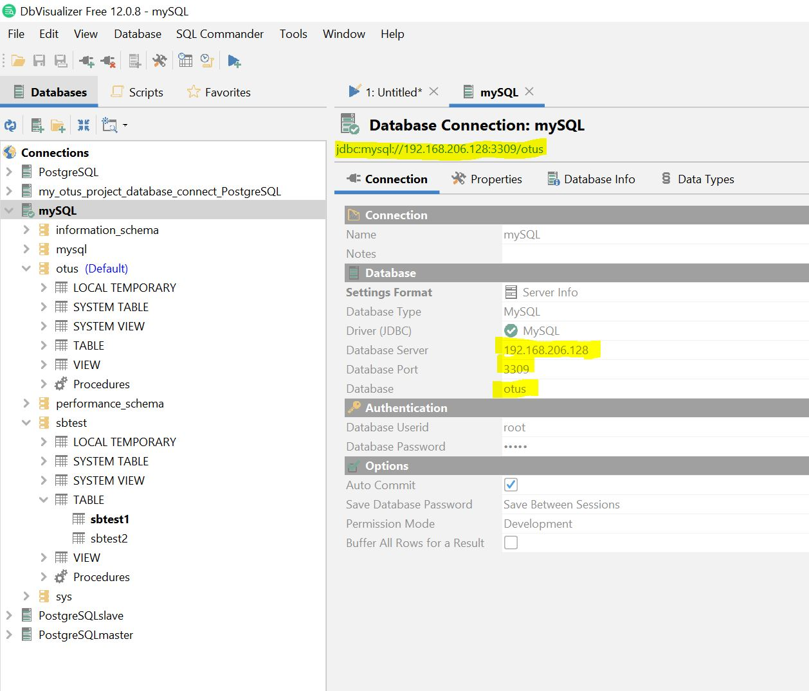
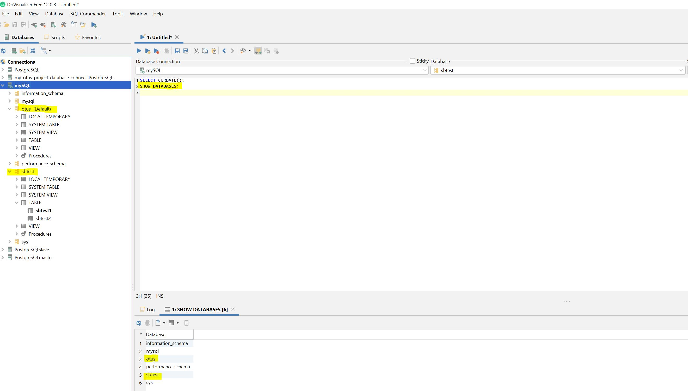

<h1 align="center">ДЗ 9</h1>
<h1 align="center">MySQL</h1>

---
Добавил пару параметров в my.cnf

| Параметр                               | назначение                                                                                                                                                                                              |
| -------------------------------------- | --------------------------------------------------------------------------------------------------------------------------------------------------------------------------------------------------------|
| innodb_buffer_pool_size                | отвечает за максимальный объём оперативной памяти, которая будет выделена для хранения данных и индексов таблиц. Фактически тюнер рекомендует выделить столько RAM, сколько занимают все данные.        |
| innodb_log_file_size                   | устанавливает размер лога операций  и влияет на скорость записи данных на диск. Чем больше размер лога, тем быстрее будет происходить запись данных. MySQL имеет сразу 2 файла с логом, а опция влияет на размер каждого файла, т.е. установив значение 1 Гб выделится 2 Гб по одному на каждый лог. Есть и обратная сторона, чем больше файл с логом, тем больше времени система будет восстанавливаться во время сбоев т.к. будет много данных которые нужно применить из лога операций.                                                                                                                                                                                                                           |
| innodb_flush_log_at_trx_commit         | определяет, как именно MySQL сервер будет писать в лог на диске данные о транзакциях и имеет три допустимых значения: 0, 1, 2. Тюнинг этого параметра повысит скорость записи в базу данных в десятки и сотни раз. По-умолчанию это значение установлено в значение 1, что даёт самые надежные гарантии сохранности данных, но и является при этом самым медленным режимом. Если потерять даже 0.000000000001% записей для вашей БД критично — то оставляйте значение 1. Такая настройка будет идеальна для приложений работающих с деньгами или имуществом. Если же небольшая потеря данных в экстремальных условиях не критична, то смело выставляйте innodb_flush_log_at_trx_commit в значение 2. В этом режиме транзакции будут сохраняться в кэш операционной системы, а запись лога на диск остаётся на совести ОС. Данные могут быть утеряны лишь в случае краха ОС и лишь за несколько секунд, что зависит от настроек операционной системы. Такой случай подойдёт для социальных сетей и прочих приложений, в которых пользователи совершают действия. Потеря нескольких лайков не окажет никакого влияния и скорее всего этого никто не заметит. При значении равном 0 лог сбрасывается на диск один раз в секунду, вне зависимости от происходящих транзакций. Скорость записи возрастает до космических масштабов, но так же растёт и риск эти данные потерять. Данные могут быть утеряны как при крахе ОС, так и при крахеMySQL сервера и обычно не более, чем за 1-2 последних секунды. Этот режим идеально подойдёт для тех ситуаций, когда вы легко сможете восстановить данные, например из реплики. Либо вы работаете с API-сервисами и при потере данных сможете их перезапросить. |


```sql
SHOW VARIABLES LIKE 'innodb_buffer_pool_size';
SHOW VARIABLES LIKE 'innodb_log_file_size';
SHOW VARIABLES LIKE 'innodb_flush_log_at_trx_commit';
```




### sysbench ###

Создал базу для теста
```sql
CREATE DATABASE sbtest;
```
Создал 2 таблицы для теста
```sh
sysbench --db-driver=mysql --mysql-user=root --mysql-password=12345 \
--mysql-host=192.168.206.128 --mysql-port=3309 --mysql-db=sbtest --range_size=100 \
--table_size=10000 --tables=2 --threads=1 --events=0 --time=60 \
--rand-type=uniform /usr/share/sysbench/oltp_read_only.lua prepare
```
Запустил тест
```sh
sysbench --db-driver=mysql --mysql-user=root --mysql-password=12345 \
--mysql-host=192.168.206.128 --mysql-port=3309 --mysql-db=sbtest --range_size=100 \
--table_size=10000 --tables=2 --threads=1 --events=0 --time=60 \
--rand-type=uniform /usr/share/sysbench/oltp_read_only.lua run
```
Результат
```sh
sysbench 1.0.6 (using system LuaJIT 2.0.4)

Running the test with following options:
Number of threads: 1
Initializing random number generator from current time


Initializing worker threads...

Threads started!

SQL statistics:
    queries performed:
        read:                            186690
        write:                           0
        other:                           26670
        total:                           213360
    transactions:                        13335  (222.24 per sec.)
    queries:                             213360 (3555.78 per sec.)
    ignored errors:                      0      (0.00 per sec.)
    reconnects:                          0      (0.00 per sec.)

General statistics:
    total time:                          60.0019s
    total number of events:              13335

Latency (ms):
         min:                                  2.86
         avg:                                  4.50
         max:                                 27.69
         95th percentile:                      4.91
         sum:                              59971.55

Threads fairness:
    events (avg/stddev):           13335.0000/0.00
    execution time (avg/stddev):   59.9715/0.00
```


| Database   | ver    |
| -----      | ---    |
| MySQL      | 8.0.15 |
